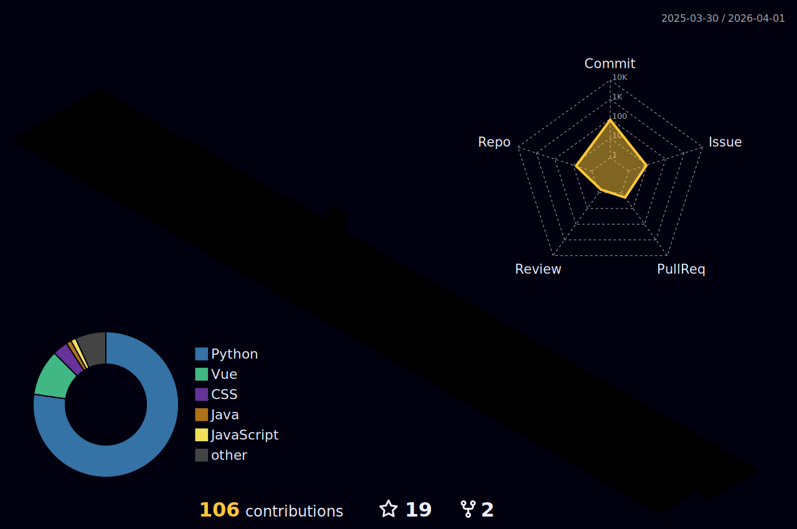

<!-- 动态问候语 -->

  
[)](https://git.io/typing-svg)

<!-- 徽章区域 -->

  
  

<!-- 统计卡片 -->

  
  

---

### 📝 名言警句
> " Twenty years from now you will be more disappointed by the things that you didn't do than by the ones you did do. So throw off the bowlines. Sail away from the safe harbor. Catch the trade winds in your sails. Explore. Dream. Discover. "
>
> "二十年之後，更令你懊悔的不是你做了什麼，而是你沒做什麼。所以解開帆索，離開安全的港灣，趕着航程中的信風，去探索，去夢想，去發現。"

<!-- 技术统计 -->

<!-- 个性化标签 -->

  
  
  
  
  

## 联系我 🌏
### SNS

  
  
  
  
  
  

### 游戏账号

  
  
  
  

### 仓库

  
  
  
  

### 其他

  
  

### 邮箱

  
  
  
  

不常用邮箱

  
  

### 绝对不是在摸鱼o(´^｀)o 
<table>
  <tr>
    <td>
      
    </td>
    <td>
      
    </td>
  </tr>
 </table>
      <!-- 3d 热力图 -->
      
      
      
