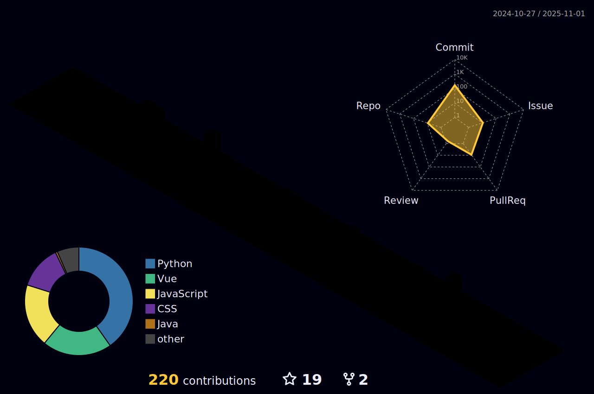

## Hi there 👋
<!-- 动态字体 -->
[)](https://git.io/typing-svg)

 <!-- 小图标 -->

  
  

   
   
    

## 我的关注者
感谢这些用户的关注，谢谢你们 (◍•ᴗ•◍)❤

“ Twenty years from now you will be more disappointed by the things that you didn't do than by the ones you did do. So throw off the bowlines. Sail away from the safe harbor. Catch the trade winds in your sails. Explore. Dream. Discover. ”

“二十年之後，更令你懊悔的不是你做了什麼，而是你沒做什麼。所以解開帆索，離開安全的港灣，趕着航程中的信風，去探索，去夢想，去發現。”

%E2%8C%92%E2%98%85-yellow)

## contact me 🌏
联系我

### SNS

### games account 游戏账号

### repository 仓库

### other 其他

### email 邮箱

不常用邮箱

### 绝对不是在摸鱼o(´^｀)o 

    
    

<!-- 3d 热力图 -->

> this is my friend，Do not follow?

> 这是我好友，不关注一波吗？

**[Anda Toshiki](https://github.com/andatoshiki)**

<!--

**DTpeel/DTpeel** is a ✨ _special_ ✨ repository because its `README.md` (this file) appears on your GitHub profile.

Here are some ideas to get you started:

- 🔭 I’m currently working on ...
- 🌱 I’m currently learning ...
- 👯 I’m looking to collaborate on ...
- 🤔 I’m looking for help with ...
- 💬 Ask me about ...
- 📫 How to reach me: ...
- 😄 Pronouns: ...
- ⚡ Fun fact: ...
-->
